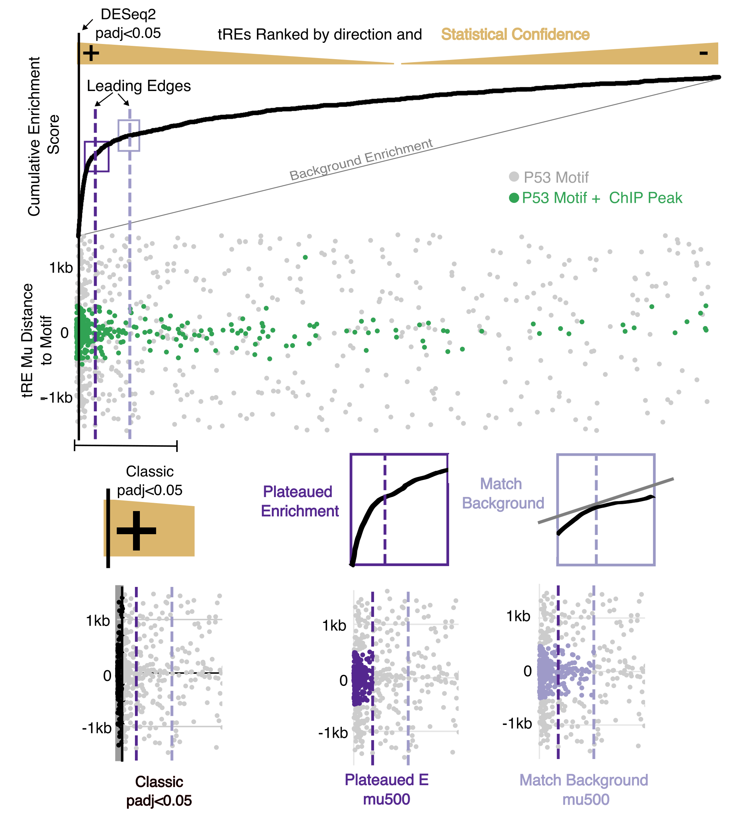
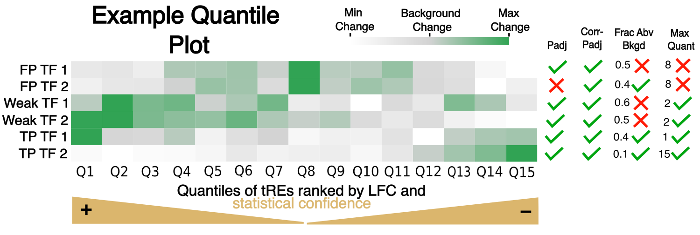
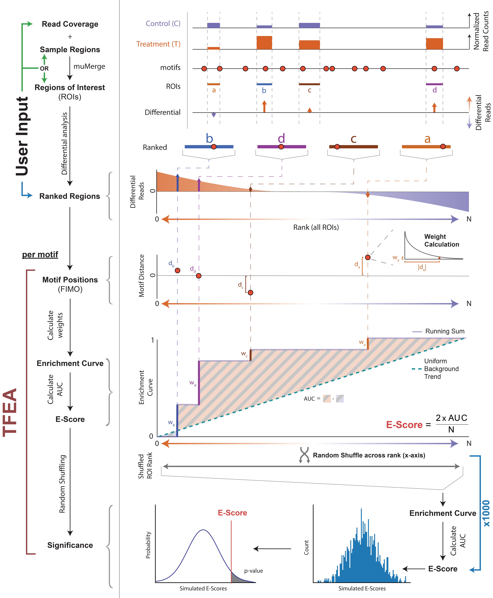
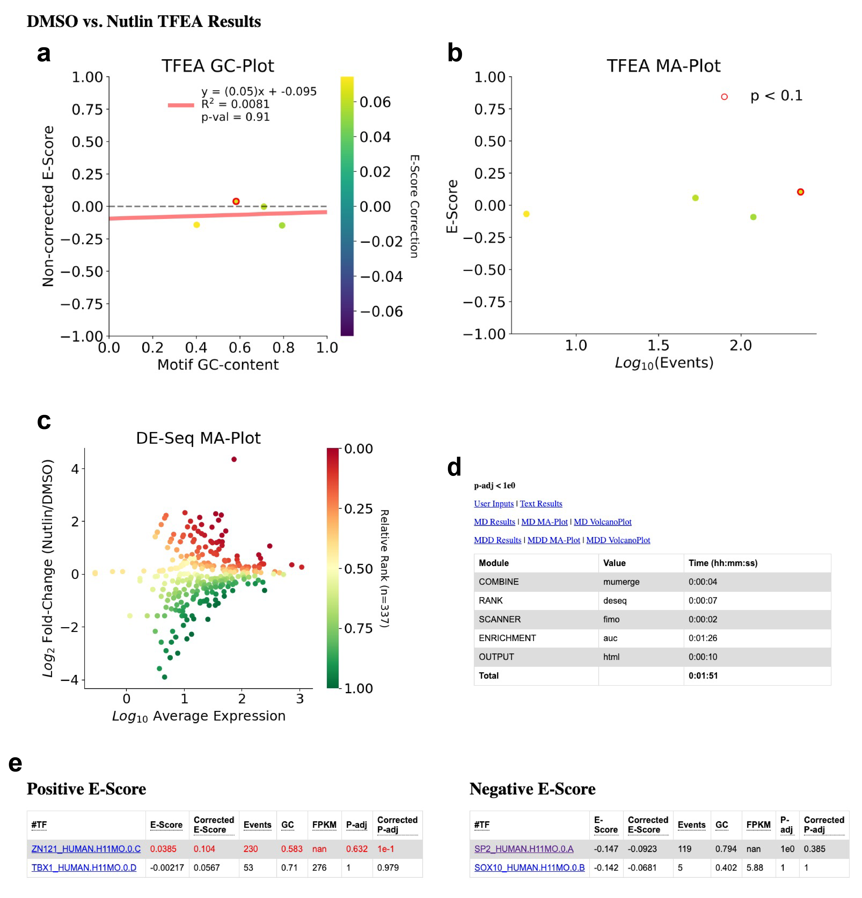
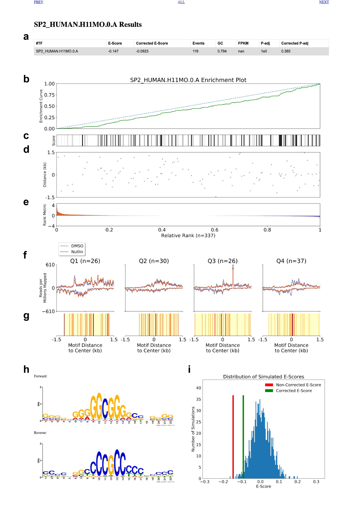

<H1>Transcription Factor Enrichment Analysis (TFEA)</H1>
<H2 id="TableOfContents">Table of Contents</H2>

0. <A href="#WhatsNew">What's New?</A>
1. <A href="#Pipeline">Pipeline</A>
2. <A href="#InstallationandRequirements">Installation and Requirements</A>
   - <A href="#TFEA">TFEA</A>
   - <A href="#InstallingTFEAwithGithub">TFEA with Github</A>
   - <A href="#DESeq">DESeq</A>
   - <A href="#Bedtools">Bedtools</A>
   - <A href="#Samtools">Samtools</A>
   - <A href="#MEMESuite">MEME Suite</A>
     - <A href="#ImageMagick">Image Magick</A>
   - <A href="#FIJIModules">FIJI Modules</A>
3. <A href="#SuggestedUsage">Suggested Usage</A>
4. <A href="#BasicUsage">Basic Usage</A>
   - <A href="#TestingTFEA">Testing TFEA</A>
   - <A href="#RunningTFEA">Running TFEA</A>
5. <A href="#AdvancedUsage">Advanced Usage</A>
   - <A href="#AdvancedParameters">Advanced Parameters</A>
      - <A href="#FIMO">FIMO</A>
      - <A href="#BatchCorrection">Batch Correction</A>
      - <A href="#ConfigurationFile">Configuration File</A>
   - <A href="#UsingSBATCH">Using SBATCH</A>
   - <A href="#PreProcessedInputs">Pre-Processed Inputs</A>
   - <A href="#SecondaryAnalysis">Secondary Analysis (MD, MDD)</A>
   - <A href="#FPKM">Measuring TF FPKM</A>
   - <A href="#SimulatedData">Generating Simulated Data</A>
   - <A href="RerunningTFEA">Rerunning TFEA</A>
   - <A href="#HelpMessage">Help Message</A>
6. <A href="#ExampleOutput">Example Output</A>
7. <A href="#ContainerUsage">Container Usage</A>
   - <A href="#SingularityBuild">Building the Singularity Container</A>
   - <A href="#SingularityUsage">Using the Singularity Container</A>
   - <A href="#DockerBuild">Building the Docker Container</A>
   - <A href="#DockerUsage">Using the Docker Container</A>
8. <A href="#ContactInformation">Contact Information</A>
 
<br></br>

<H2 id="WhatsNew">What's New?</H2>

### 1. New Recommended Inputs for Nascent RNA-seq
* We now have an improved Nascent RNA sequencing pipeline for TFEA input at _____
* The way to use this input is found in <A href="#SuggestedUsage">Suggested Usage</A>

### 2. Choose TF-specific FIMO pvalues
#### Why should I care?
TFEA doesn't call significance of a TF well  if there are a ton (e.g. EVENTS > 8,000) or few (e.g. EVENTS < 600) regions with a motif. The complexity of TF motifs means the FIMO p-value cutoffs to use for identifying instances may need to be different for different motifs. 
#### How do I do this?
Option —fimo_pval can now take either a single value (e.g. 0.00005) **or** a file with TF motifs and FIMO pvalues to use. A good default is provided at assets/PVAL_CUTOFF_ESTIMATES_H12.CORE.txt.

### 3. Leading Edge to address false positives & recall of chaning regions
#### A. Get Improved metrics for False Positives:
We found that transcription factors were likely false positives if:
* the fraction of regions with a change in enrichment score > background was higher than 0.5, these (**FrcAbv Back**)
* The quantile of tREs with the maximum change in enrichment score was in the middle (**MaxQ** is closer to 1/2 of **num_quant** (default 15))

#### B. Get Improved recall of responding regions (e.g. enhancers):
The leading edges consider *both motifs and statistical confidence* to call regions changing. Therefore, it performs better than classic approaches (e.g. DESeq2) with small transcriptional changes or where there are sample outliers. 




  * Two versions:
    1. Plateaued Enrichment: Captures where the change in enrichment scores starts to plateau to noise. More **conservative**.  
    2. Match Background: Captures where the change in enrichment scores matches what we expect from noise. Less conservative but also reveals **larger scale trends**.
* How do I use these to get regions changing?
    * The jupyter notebook X indicates how you can read in TFEA results to get regions either specific to a TF or across all significant TFs.
#### What are the relevant output changes?
Results:
  * Check out the Results.txt at <A href="#ExampleOutput">Example Output</A>

Files:
  * The leading edge uses the distances of the ranked regions from a given TF. If you would like to keep these files to find the regions within the leading edge that also fit certain motif distances, use the flag —keep_le_files. 

Plots:
  * Enrichment curve graphs now include leading edges as vertical lines (purple=Plateaued Enrichment, red=Match Background)
  * Quantile Map 
    * Graph of **enrichment trends across all TFs** reaching padj cutoffs in either original or corrected adjusted pvalues. Ranked regions are split into quantiles (num_quant=15 by default). The magnitude of the change in enrichment trends for each graph are plotted where green is greater than background. 
    * Example below shows two false positives (greatest enrichment increase at middle where no regions should be changing), weak positives (enrichment change extended throughout regions), and true positives (greatest enrichment increase clearly at poles).
    * Access via “Quantile Map” link on the results.html (or plots/Quantile.map.png)


### Want the older version?
* Go to _______.
 
<H2 id="Pipeline">TFEA Pipeline</H2>
 



 
<br></br>

<H2 id="InstallationandRequirements">Installation and Requirements</H2>

   <H3 id="TFEA">TFEA</H3>

To install, this package and all python3 dependencies:

```
python3 -m pip install tfea
```

This should take no longer than several minutes.

Once successfully installed, you should be able to run the tfea command from anywhere, try:

```
TFEA --help
```

<H3 id="InstallingTFEAwithGithub">Installing TFEA with Github</H3>
Github would provide the most uptodate version of the code. To install and build TFEA, run the following

```
git clone git@github.com:Dowell-Lab/TFEA.git
cd TFEA
python -m venv vir_TFEA # create virtual python environment
source vir_TFEA/bin/activate # activate the environment
pip3 install -r requirements.txt # install the requirements
python setup.py build
python setup.py install
```

<b>*Note for Advanced users:*</b> If you edit any of the source code (e.g. TFEA/enrichment.py), you will need to rerun the setup.py build and install to apply your changes.

<b>*Note:*</B> If you plan to run TFEA only on FIJI using the --sbatch flag, then you only need to install DESeq and DESeq2. Otherwise, follow the instructions below for installing all TFEA dependencies.
  
  <H3 id="DESeq">DESeq</H3>
  TFEA uses DESeq or DESeq2 (depending on replicate number) to rank inputted bed files based on fold change significance. If on FIJI, make sure all gcc modules are unloaded before installing DESeq or DESeq2. This can be accomplished with
  
  `module unload gcc`   or  `module purge`.
  
  To install DESeq and DESeq2 type in your terminal:
    
  ```
  R
  
  > if (!requireNamespace("BiocManager", quietly = TRUE))
  >   install.packages("BiocManager")
  
  > BiocManager::install("DESeq")
  > BiocManager::install("DESeq2")
  ```
  
  <H3 id="Bedtools">Bedtools</H3>
  TFEA uses Bedtools to do several genomic computations. Instructions for installing bedtools can be found here:
  
  <a href="http://bedtools.readthedocs.io/en/latest/content/installation.html">Bedtools Installation</a>
  
  If you are on FIJI compute cluster, bedtools is available as a module:
  
  ```
  module load bedtools/2.25.0
  ```
  
  <H3 id="Samtools">Samtools</H3>
  TFEA uses samtools to index bam files. Samtools download and install instructions can be found here:
  <a href="http://www.htslib.org/download/">Samtools Download and Install</a>
  
  If you are on FIJI compute cluster, bedtools is available as a module:
  
  ```
  module load samtools/1.8
  ```
  
  <H3 id="MEMESuite">MEME Suite</H3>
  TFEA uses the MEME suite to scan sequences from inputted bed files for motif hits using the background atcg distribution form inputted bed file regions. TFEA also uses the MEME suite to generate motif logos for html display. Instructions for downloading and installing the MEME suite can be found here:
  
  <a href="http://meme-suite.org/doc/install.html?man_type=web">MEME Download and Installation</a>
  
  If you are on FIJI compute cluster, the meme suite is available as a module:
  
  ```
  module load meme/5.0.3
  ```
  
  <H4 id="ImageMagick">Image Magick</H3>
  TFEA uses the meme2images script within MEME to produce motif logo figures. This requires Image Magick, which is a common linux utility package sometimes pre-installed on machines. To check if you have Image Magick installed try:
  
  ```
  identify -version
  ```
  
  If you do not have Image Magick installed, follow these instructions:
  
  <a href="https://imagemagick.org/script/install-source.php">Image Magick Download and Installation</a>
  
  <H3 id="FIJIModules">FIJI Modules</H3>
  Below is a summary of all FIJI modules needed to run TFEA (not including R). A full example can be found with example_slurm_usage.sbatch.
  
  ```
  module load python/3.7.4

  module load samtools/1.3.1
  module load bedtools/2.25.0
  module load meme/5.0.3
  ```

<br></br>
<H2 id="SuggestedUsage">Suggested Usage with Nascent RNA sequencing</H2>
The following (work)[] has shown below to be the best pipeline for running TFEA with Nascent RNA sequencing (e.g. PRO-seq, GRO-seq):

### 1. Get Bidirectionals 
- Use Tfit [and optionally dREG] with 3' bedgraphs of each of your samples. You can use the Dowell Lab **[Nextflow pipeline](https://github.com/Dowell-Lab/Bidirectional-Flow)** for this.

### 2. Get the consensus regions for these bidirectionals 
- Use **[muMerge](https://github.com/Dowell-Lab/muMerge)**

### 3. Obtain Bidirectional counts and Categorize Gene TSS vs. NonTSS Bidirectionals
- Use the following **[pipeline](https://github.com/Dowell-Lab/Bidir_Counting_Analysis)** (Nextflow and bash options)
    
#### Why is this step crucial?
1. **Accurate ranking of differentially transcribed bidirectionals is key to TFEA**, yet obtaining bidirectional counts is nontrivial. This pipeline provides a streamlined solution.
2. **Gene TSS bidirectionals can introduce noise**, obscuring the enrichment of enhancer-focused TFs (e.g., P5*). Separating NonTSS from TSS bidirectionals improves sensitivity of TF calls.
### 4. Use the Processed Counts for TFEA
- The **NonTSS** (and separately, **TSS**) bidirectional counts obtained in the previous step should be used as input into TFEA:

```
python3 /Users/hoto7260/src/TFEA/vir_TFEA/lib/python3.7/site-packages/tfea-1.1.4-py3.7.egg/TFEA  \
        --output /out/dir \
        --count_file /nontsscount/file/from/BCA.txt \
        --label1 CTL \
        --label2 TMT \
        --treatment CTL,CTL,TMT,TMT
        --fimo_motifs ~/TFEA/motif_files/HOCOv12_HUMAN.meme \
        --fimo_thresh ~/TFEA/assets/HOCOv12_HUMAN_thresh.txt \
        --fimo_background ~/TFEA/assets/enhancer_background_flat \
        --output_type html
```

Quick Parameter Explanations:
* **label1** & **label2** are the labels used for your baseline (label1) vs treatment (label2)
* **treatment** specifies the order of the labels according to your count file to be used for DESeq2 (In this case showing that the first two count columns correspond to label 1 (control) and the second label 2 (treatment))
* **fimo_motifs** has the TF motifs of interest in meme format
* **fimo_thresh** corresponds to the pvalue cutoff for a TF motif to be called. It can be a number (e.g. 0.00005) or file with a cutoff for each TF motif in fimo_motifs
* **fimo_background** is an optional file with the background on which FIMO bases it's analysis. In this case we do uniform 


<H2 id="BasicUsage">Basic Usage for Other data types</H2>

<H3 id="TestingTFEA">Testing TFEA</H3>
To make sure TFEA is installed properly, run the following tests:

<b>*Note:*</b> If you chose to skip installations because you were going to run TFEA using the --sbatch flag, make sure you load the appropriate modules on FIJI or these tests will fail.

```
TFEA --test-install
TFEA --test-full
```

These should each take no longer than several minutes to run

If on a compute cluster with slurm the --sbatch flag is compatible with --test-full and is recommended on FIJI. Execute like so:

```
TFEA --test-full --sbatch your_email@address.com
```

<H3 id="RunningTFEA">Running TFEA</H3>
Once you've run the above tests successfully, you should be ready to run the full version of TFEA. Below are the minimum required inputs to run the full TFEA pipeline. Test files are provided in './TFEA/test/test_files' within this repository.

An example sbatch script is found with example_slurm_usage.sbatch. Importantly, this is built for Fiji so some of the module loads may not be available to you.

```
TFEA --output ./TFEA/test/test_files/test_output \
--bed1 ./TFEA/test/test_files/SRR1105736.tfit_bidirs.chr22.bed ./TFEA/test/test_files/SRR1105737.tfit_bidirs.chr22.bed \
--bed2 ./TFEA/test/test_files/SRR1105738.tfit_bidirs.chr22.bed ./TFEA/test/test_files/SRR1105739.tfit_bidirs.chr22.bed \
--bam1 ./TFEA/test/test_files/SRR1105736.sorted.chr22.subsample.bam ./TFEA/test/test_files/SRR1105737.sorted.chr22.subsample.bam \
--bam2 ./TFEA/test/test_files/SRR1105738.sorted.chr22.subsample.bam ./TFEA/test/test_files/SRR1105739.sorted.chr22.subsample.bam \
--label1 DMSO --label2 Nutlin \
--genomefasta ./TFEA/test/test_files/chr22.fa \
--fimo_motifs ./TFEA/test/test_files/test_database.meme
```

<H2 id="AdvancedUsage">Advanced Usage</H2> 

<H3 id="AdvancedParameters">Additional Parameters</H3>

<H4 id="FIMO">Fimo Scanning</H4>

Results from motifs with more than 10,000 (preferably 8,000) regions with motifs can lead to false positive calls and less confident Leading Edges. There are two ways to avoid this:
1. FIMO Pvalue
- Argument **fimo_thresh** takes in either a fixed number (e.g. 0.00005) or a file with the TF motifs and coressponding pvalue motifs. If a motif is not within the file, the pvalue of 1e-6 is used. 
  - We provide a default file in assets for HOCOv12: HOCOv12_HUMAN_thresh.txt. (Also includes the number of Bidirectionals in the DBNascent database with the motif at different p-value cutoffs)
  - File must be tab delimited with *at least* columns MOTIF and best_pval. 

  ```
    MOTIF  	best_pval
    AHR.H12CORE.0.P.B	10	1e-05
    AHRR.H12CORE.0.P.C	11	1e-05
    ALX1.H12CORE.0.SM.B	20	1e-06
  ```

2. FIMO Background
- At default, TFEA uses the background frequency of ATGC from the regions themselves.
- You can use argument **fimo_background** to provide a different background.
- We provide a file for uniform background in assets: enhancer_background_flat.

<H4 id="BatchCorrection">Batch Correction</H4>

The presence of batch effects is common in sequencing data. TFEA can account for batch effects when performing ROI ranking using DE-Seq using built in functions. To correct for batch effects, specify a comma-separated list of batch labels to apply to your bam files in order of bam1 then bam2. For example:

```
--bam1 condition1_batch1 condition1_batch2 condition1_batch3
--bam2 condition2_batch1 condition2_batch2 condition2_batch3
--batch 1,2,3,1,2,3
```

<H4 id="ConfigurationFile">Configuration File</H4>
TFEA can be run exclusively through the command line using flags. Alternatively, TFEA can be run using a configuration file (.ini) that takes in flags as variables. For example:

```
TFEA --config ./TFEA/test/test_files/test_config.ini
```

This can be helpful to keep track of different TFEA runs and because you can use variables within the config file to clean up your input. For documentation on config files and what you can do with them see <a href="https://docs.python.org/3.6/library/configparser.html#supported-ini-file-structure">Supported INI File Structure</a> and <a href="https://docs.python.org/3.6/library/configparser.html#interpolation-of-values">Interpolation of values (ExtendedInterpolation)</a>

<b>*Notes:*</b>

1. Section headers (ex: `[OUTPUT]`) don't matter but you need to have at least ONE section header to be a viable .ini file.
2. Capitalization of variables doesn't matter.
3. Feel free to specify any additional variables you like (variables are bash-like), TFEA will only parse variables that match a flag input.
4. If an input is provided both as a flag and in a configuration file, TFEA prioritizes the command line flag input.

Below is an example of a configuration file (./test_files/test_config.ini):

  ```bash
[OUTPUT]
OUTPUT='./TFEA/test/test_files/test_output/'
LABEL1='Condition 1'
LABEL2='Condition 2'

[DATA]
TEST_FILES='./TFEA/test/test_files/'
BED1=[${TEST_FILES}+'SRR1105736.tfit_bidirs.chr22.bed',${TEST_FILES}+'SRR1105737.tfit_bidirs.chr22.bed']
BED2=[${TEST_FILES}+'SRR1105738.tfit_bidirs.chr22.bed',${TEST_FILES}+'SRR1105739.tfit_bidirs.chr22.bed']
BAM1=[${TEST_FILES}+'SRR1105736.sorted.chr22.subsample.bam', ${TEST_FILES}+'SRR1105737.sorted.chr22.subsample.bam']
BAM2=[${TEST_FILES}+'SRR1105738.sorted.chr22.subsample.bam', ${TEST_FILES}+'SRR1105739.sorted.chr22.subsample.bam']

[MODULES]
TEST_FILES='./TFEA/test/test_files/' #You need to re-initialize variables within each [MODULE]
FIMO_MOTIFS=${TEST_FILES}+'test_database.meme'
GENOMEFASTA=${TEST_FILES}+'chr22.fa'

[OPTIONS]
OUTPUT_TYPE='html'
PLOTALL=True
```

<H3 id="UsingSBATCH">Using SBATCH</H3>

Specifying the `--sbatch` flag will submit TFEA to a compute cluster assuming you are logged into one. If the `--sbatch` flag is specified, it MUST be followed by an e-mail address to send job information to. For example:


```
TFEA --config ./TFEA/test/test_files/test_config.ini --sbatch your_email@address.com
```

Additionally, the following flags can be used to change some of the job parameters and specify a python virtual environment:

```
  --cpus CPUS           Number of processes to run in parallel. Warning:
                        Increasing this value will significantly increase
                        memory footprint. Default: 1
  --mem MEM             Amount of memory to request forsbatch script. Default:
                        50gb
  --venv VENV           Full path to virtual environment.
```

<b>*Note:*</b> `--cpus` also works without the `--sbatch` flag. The `--venv` flag takes the root venv directory, it then activates the venv by calling `source <venv path>/bin/activate`


<H3 id="PreProcessedInputs">Using Pre-processed Inputs</H3>
TFEA has several pipeline elements to it that a user may bypass by providing downstream pre-processed files. These files can be generated by TFEA if running the full pipeline and may also be used to speed up reruns of TFEA. Below are the three types of pre-processed inputs, short descriptions, an example of the file, and a usage example with TFEA (in some cases there are other inputs needed to go along with the pre-processed file). If multiple pre-processed inputs specified, TFEA will use the most downstream one.

<H4>combined_file</H4>

A sorted (by chrom, start, stop) bed file containing regions of interest

Example (./test_files/test_combined_file.bed)
```
#chrom   start stop
chr22 10683195	10683999
chr22	16609343	16609405
chr22	16901069	16902599
chr22	17036962	17037636
chr22	17158022	17160214
...
```

Usage with TFEA
```
TFEA --output ./TFEA/test/test_files/test_output \
--combined_file ./TFEA/test/test_files/test_combined_file.bed \
--bam1 ./TFEA/test/test_files/SRR1105736.sorted.chr22.subsample.bam ./test_files/SRR1105737.sorted.chr22.subsample.bam \
--bam2 ./TFEA/test/test_files/SRR1105738.sorted.chr22.subsample.bam ./test_files/SRR1105739.sorted.chr22.subsample.bam \
--label1 condition1 --label2 condition2 \
--genomefasta ./TFEA/test/test_files/chr22.fa \
--fimo_motifs ./TFEA/test/test_files/test_database.meme
```

<H4>count_file</H4>

A featurecounts formatted output file with counts of the different bidirectionals. The Geneid must be in the format chr:X:Y where the midpoint between X and Y is the mu for the bidirectional (or midpoint around which you want to predict motifs). Using the pipeline suggested in "SUGGESTED USAGE" will ensure this. The bam names are inconsequential due to the treatment parameter.

Example (./test_files/test_count.bed)

```
Geneid	Chr	Start	End	Strand	Length	./bam1	./bam2	./bam3	./bam4
chr21:5010512-5012512	chr21;chr21	5010512;5011512	5011512;5012512	+;-	1000;1000	20	30	16	10
chr21:5013005-5015005	chr21;chr21	5013005;5014005	5014005;5015005	+;-	1000;1000	11	25	51	42
chr21:5018120-5020120	chr21;chr21	5018120;5019120	5019120;5020020	+;-	1000;900	20	24	25	17
```

Usage with TFEA

```
python3 /Users/hoto7260/src/TFEA/vir_TFEA/lib/python3.7/site-packages/tfea-1.1.4-py3.7.egg/TFEA  \
        --output /out/dir \
        --count_file /nontsscount/file/from/BCA.txt \
        --label1 CTL \
        --label2 TMT \
        --treatment CTL,CTL,TMT,TMT
        --fimo_motifs ~/TFEA/motif_files/HOCOv12_HUMAN.meme \
        --fimo_thresh ~/TFEA/assets/HOCOv12_HUMAN_thresh.txt \
        --fimo_background ~/TFEA/assets/enhancer_background_flat \
        --output_type html
```

* **treatment** is needed to indicate which of the labels each bam in the counts file corresponds to. 
  - In this case bams 1 & 2 are control (CTL) and 3 & 4 are treatment (TMT)

<H4>ranked_file</H4>

A ranked bed file with regions of interest. **Important**: The regions must be 3000bp wide (1.5kb around the original middle (or mu) of the region) for proper motif distance analysis.

<b>*Note:*</b> Specifying a ranked_file turns off some plotting functionality

Example (./test_files/test_ranked_file.bed)

```
#chrom	start	stop
chr22	50794870	50797870
chr22	21554591	21557591
chr22	50304644	50307644
chr22	39096295	39099295
chr22	31176104	31179104
...
```

Usage with TFEA

```
TFEA --output ./TFEA/test/test_files/test_output \
--ranked_file ./TFEA/test/test_files/test_ranked_file.bed \
--label1 condition1 --label2 condition2 \
--genomefasta ./TFEA/test/test_files/chr22.fa \
--fimo_motifs ./TFEA/test/test_files/test_database.meme
```

<H4>fasta_file</H4>

A ranked fasta file with regions of interest (sequences must have unique names but these names aren't used for anything). 

<b>*Note:*</b> Specifying a fasta_file turns off some plotting functionality

Example (./test_files/test_fasta_file.bed)

```
>chr22:50794870-50797870
ccgccccacactgacgcagt...ccgcctcagcctcctaaa
>chr22:21554591-21557591
cttggggagagcagaagcca...gtgcagtggtgcaatctt
>chr22:50304644-50307644
CTGAGCACCCCCCACCAGCCA...GGAGACGGGGCCTTTGT
...
```

Usage with TFEA

```
TFEA --output ./TFEA/test/test_files/test_output \
--fasta_file ./TFEA/test/test_files/test_fasta_file.fa \
--label1 condition1 --label2 condition2 \
--genomefasta ./TFEA/test/test_files/chr22.fa \
--fimo_motifs ./TFEA/test/test_files/test_database.meme
```

<H3 id="SecondaryAnalysis">Secondary Analysis</H3>
TFEA can also perform MD-Score analysis and differential MD-Score analysis. This can be switched on easily if running the full pipeline:

```
TFEA --output ./TFEA/test/test_files/test_output \
--combined_file ./TFEA/test/test_files/test_combined_file.bed \
--bam1 ./TFEA/test/test_files/SRR1105736.sorted.chr22.subsample.bam ./TFEA/test/test_files/SRR1105737.sorted.chr22.subsample.bam \
--bam2 ./TFEA/test/test_files/SRR1105738.sorted.chr22.subsample.bam ./TFEA/test/test_files/SRR1105739.sorted.chr22.subsample.bam \
--label1 condition1 --label2 condition2 \
--genomefasta ./TFEA/test/test_files/chr22.fa \
--fimo_motifs ./TFEA/test/test_files/test_database.meme \
--md --mdd
```

These secondary analyses can also take pre-processed input similar to TFEA. See the 'Secondary Analysis Inputs' section in the <A href="#HelpMessage">help message</A> for more information.

<H3 id="FPKM">Measuring TF FPKM</H3>
TFEA will also measure the FPKM of TF genes within your data if desired. This requires input into the `--motif_annotations` flag which is a bed file with motif names as the 4th column. Example:

```
chr1	3698045	3733079	P73_HUMAN.H11MO.0.A	0	+
chr1	6579990	6589212	ZBT48_HUMAN.H11MO.0.C	0	+
chr1	15941868	15948495	ZBT17_HUMAN.H11MO.0.A	0	-
chr1	23359447	23368005	ZN436_HUMAN.H11MO.0.C	0	-
```

This special bed file can be generated from a .meme database file using a tab-separated 2-column file containing motif names to gene names and a gene annotation file:

Example of a motif_to_gene.tsv (this was generated on the HOCOMOCO v11 website):

```
Model	Transcription factor
ANDR_HUMAN.H11MO.0.A	AR
AP2A_HUMAN.H11MO.0.A	TFAP2A
AP2C_HUMAN.H11MO.0.A	TFAP2C
ASCL1_HUMAN.H11MO.0.A	ASCL1
```

Example of gene annotations:

```
chr1	11873	14409	DDX11L1;NR_046018;chr1:11873-14409	0	+
chr1	14361	29370	WASH7P;NR_024540;chr1:14361-29370	0	-
chr1	17368	17436	MIR6859-1;NR_106918;chr1:17368-17436	0	-
chr1	17368	17436	MIR6859-4;NR_128720;chr1:17368-17436	0	-
chr1	17368	17436	MIR6859-3;NR_107063;chr1:17368-17436	0	-
```

The script works by looking for gene names that correspond to each motif within the 4th column of the gene annotation file. It expects the 4th column to be ';' delimited.

Already generated motif_annotation.bed files (and also intermediate .tsv files) are located within './motif_files/'

<H3 id="SimulatedData">Generating Simulated Data</H3>
TFEA has a subpackage that is capable of generating simulated data for testing. If you have installed TFEA, it can be invoked with:

```TFEA-simulate --help```

The purpose of this subpackage is to embed motif instances into fasta sequences that can be generated randomly or be from an experimental dataset (e.g. untreated control sample). There are several key flags that control this process (each of these may be a comma-delimited list of values that would indicate multiple instances of motif adding):

`--distance_mu` : This flag controls where the center of the distribution is located (note: only normal distributions are supported at this point)

`--distance_sigma` : Controls the standard deviation of the normal distribution

`--rank_range` : Controls the range of sequences in which to add a motif

`--motif_number` : Controls the number of motifs to add to your range of sequences


<H3 id="RerunningTFEA">Rerunning TFEA</H3>
TFEA can be easily rerun given one or multiple TFEA output folders. This works simply by rerunning the rerun.sh script which contains all command-line flag inputs. TFEA also automatically creates a copy of your configuration file (if used) within the output folder which is then also used when rerunning (so no need to worry about editing the original configuration file). To rerun a single TFEA output folder:

```
TFEA --rerun ./TFEA/test/test_files/test_output
```

The `--rerun` flag also supports patterns containing wildcards to rerun all TFEA output folders that match. For example:

```
TFEA --rerun ./TFEA/test/test_files/test*
```

This works by looking recursively into all folders and subfolders for rerun.sh scripts and then executing `sh rerun.sh`, so use with caution!

<H3 id="HelpMessage">Help Message</H3>
Below are all the possible flags that can be provided to TFEA with a short description and default values.

```
usage: TFEA [-h] [--output DIR] [--bed1 [BED1 [BED1 ...]]]
            [--bed2 [BED2 [BED2 ...]]] [--bam1 [BAM1 [BAM1 ...]]]
            [--bam2 [BAM2 [BAM2 ...]]] [--bg1 [BG1 [BG1 ...]]]
            [--bg2 [BG2 [BG2 ...]]] [--label1 LABEL1] [--label2 LABEL2]
            [--genomefasta GENOMEFASTA] [--fimo_motifs FIMO_MOTIFS]
            [--config CONFIG] [--sbatch SBATCH] [--test-install] [--test-full]
            [--combined_file COMBINED_FILE] [--ranked_file RANKED_FILE]
            [--fasta_file FASTA_FILE] [--md] [--mdd]
            [--md_bedfile1 MD_BEDFILE1] [--md_bedfile2 MD_BEDFILE2]
            [--mdd_bedfile1 MDD_BEDFILE1] [--mdd_bedfile2 MDD_BEDFILE2]
            [--md_fasta1 MD_FASTA1] [--md_fasta2 MD_FASTA2]
            [--mdd_fasta1 MDD_FASTA1] [--mdd_fasta2 MDD_FASTA2]
            [--mdd_pval MDD_PVAL] [--mdd_percent MDD_PERCENT]
            [--combine {mumerge,intersect/merge,mergeall,tfitclean,tfitremovesmall}]
            [--rank {deseq,fc,False}] [--scanner {fimo,genome hits}]
            [--enrichment {auc,auc_bgcorrect}] [--fimo_thresh FIMO_THRESH]
            [--fimo_background FIMO_BACKGROUND] [--genomehits GENOMEHITS]
            [--singlemotif SINGLEMOTIF] [--permutations PERMUTATIONS]
            [--largewindow LARGEWINDOW] [--smallwindow SMALLWINDOW]
            [--padjcutoff PADJCUTOFF] [--plot_format {png,svg,pdf}]
            [--dpi DPI] [--plotall] [--metaprofile] [--output_type {txt,html}]
            [--batch BATCH] [--cpus CPUS] [--mem MEM]
            [--motif_annotations MOTIF_ANNOTATIONS] [--bootstrap BOOTSTRAP]
            [--basemean_cut BASEMEAN_CUT] [--rerun [RERUN [RERUN ...]]]
            [--gc GC] [--venv VENV] [--debug]

Transcription Factor Enrichment Analysis (TFEA) v1.1.3

optional arguments:
  -h, --help            show this help message and exit

Main Inputs:
  Inputs required for full pipeline

  --output DIR, -o DIR  Full path to output directory. If it exists, overwrite
                        its contents.
  --bed1 [BED1 [BED1 ...]]
                        Bed files associated with condition 1
  --bed2 [BED2 [BED2 ...]]
                        Bed files associated with condition 2
  --bam1 [BAM1 [BAM1 ...]]
                        Sorted bam files associated with condition 1. Must be
                        indexed.
  --bam2 [BAM2 [BAM2 ...]]
                        Sorted bam files associated with condition 2. Must be
                        indexed.
  --bg1 [BG1 [BG1 ...]]
                        Sorted bedGraph files associated with condition 1.
                        Must be indexed.
  --bg2 [BG2 [BG2 ...]]
                        Sorted bedGraph files associated with condition 2.
                        Must be indexed.
  --label1 LABEL1       An informative label for condition 1
  --label2 LABEL2       An informative label for condition 2
  --genomefasta GENOMEFASTA
                        Genomic fasta file
  --fimo_motifs FIMO_MOTIFS
                        Full path to a .meme formatted motif databse file.
                        Some databases included in motif_files folder.
  --config CONFIG, -c CONFIG
                        A configuration file that a user may use instead of
                        specifying flags. Command line flags will overwrite
                        options within the config file. See examples in the
                        config_files folder.
  --sbatch SBATCH, -s SBATCH
                        Submits an sbatch (slurm) job. If specified, input an
                        e-mail address.
  --test-install, -ti   Checks whether all requirements are installed and
                        command-line runnable.
  --test-full, -t       Performs unit testing on full TFEA pipeline.

Processed Inputs:
  Input options for pre-processed data

  --combined_file COMBINED_FILE
                        A single bed file combining regions of interest.
  --ranked_file RANKED_FILE
                        A bed file containing each regions rank as the 4th
                        column.
  --fasta_file FASTA_FILE
                        A fasta file containing sequences to be analyzed,
                        ranked by the user.

Secondary Analysis Inputs:
  Input options for performing MD-Score and Differential MD-Score analysis

  --md                  Switch that controls whether to perform MD analysis.
  --mdd                 Switch that controls whether to perform differential
                        MD analysis.
  --md_bedfile1 MD_BEDFILE1
                        A bed file for MD-Score analysis associated with
                        condition 1.
  --md_bedfile2 MD_BEDFILE2
                        A bed file for MD-Score analysis associated with
                        condition 2.
  --mdd_bedfile1 MDD_BEDFILE1
                        A bed file for Differential MD-Score analysis
                        associated with condition 1.
  --mdd_bedfile2 MDD_BEDFILE2
                        A bed file for Differential MD-Score analysis
                        associated with condition 2.
  --md_fasta1 MD_FASTA1
                        A fasta file for MD-Score analysis associated with
                        condition 1.
  --md_fasta2 MD_FASTA2
                        A fasta file for MD-Score analysis associated with
                        condition 2.
  --mdd_fasta1 MDD_FASTA1
                        A fasta file for Differential MD-Score analysis
                        associated with condition 1.
  --mdd_fasta2 MDD_FASTA2
                        A fasta file for Differential MD-Score analysis
                        associated with condition 2.
  --mdd_pval MDD_PVAL   P-value cutoff for retaining differential regions.
                        Default: 0.2
  --mdd_percent MDD_PERCENT
                        Percentage cutoff for retaining differential regions.
                        Default: False

Modules:
  Options for different modules

  --combine {mumerge,intersect/merge,mergeall,tfitclean,tfitremovesmall}
                        Method for combining input bed files. Default: mumerge
  --rank {deseq,fc,False}
                        Method for ranking combined bed file
  --scanner {fimo,genome hits}
                        Method for scanning fasta files for motifs. Default:
                        fimo
  --enrichment {auc,auc_bgcorrect}
                        Method for calculating enrichment. Default: auc

Scanner Options:
  Options for performing motif scanning

  --fimo_thresh FIMO_THRESH
                        P-value threshold for calling FIMO motif hits OR file 
                        with XXX.
                        Default: 1e-6
  --fimo_background FIMO_BACKGROUND
                        Options for choosing mononucleotide background
                        distribution to use with FIMO. Default:
                        largewindow{'largewindow', 'smallwindow', int, file}
  --genomehits GENOMEHITS
                        A folder containing bed files with pre-calculated
                        motif hits to a genome. For use with 'genome hits'
                        scanner option.
  --singlemotif SINGLEMOTIF
                        Option to run analysis on a subset of motifs within
                        specified motif database or genome hits. Can be a
                        single motif or a comma-separated list of motifs.

Enrichment Options:
  Options for performing enrichment analysis

  --permutations PERMUTATIONS
                        Number of permutations to perfrom for calculating
                        p-value. Default: 1000
  --largewindow LARGEWINDOW
                        The size (bp) of a large window around input regions
                        that captures background. Default: 1500
  --smallwindow SMALLWINDOW
                        The size (bp) of a small window arount input regions
                        that captures signal. Default: 150

Output Options:
  Options for the output.

  --padjcutoff PADJCUTOFF
                        A p-adjusted cutoff value that determines some
                        plotting output.
  --plot_format {png,svg,pdf}
                        Format of saved figures. Default: png
  --dpi DPI             Resolution of saved figures. Applies to png. Default:
                        100
  --plotall             Plot graphs for all motifs.Warning: This will make
                        TFEA run much slower andwill result in a large output
                        folder.
  --metaprofile         Create meta profile plots per quartile. Warning: This
                        will make TFEA run much slower and consume a lot more
                        memory.
  --output_type {txt,html}
                        Specify output type. Selecting html will increase
                        processing time and memory usage. Default: txt

Miscellaneous Options:
  Other options.

  --batch BATCH         Comma-separated list of batches to assign to bam files
                        in order of bam1 files then bam2 files. For use only
                        when ranking with DE-Seq.
  --cpus CPUS           Number of processes to run in parallel. Warning:
                        Increasing this value will significantly increase
                        memory footprint. Default: 1
  --mem MEM             Amount of memory to request for sbatch script.
                        Default: 20gb
  --motif_annotations MOTIF_ANNOTATIONS
                        A bed file specifying genomic coordinates for genes
                        corresponding to motifs. Motif name must be in the 4th
                        column and match what is in the database.
  --bootstrap BOOTSTRAP
                        Amount to subsample motifhits to. Set to False to turn
                        off. Default: False
  --basemean_cut BASEMEAN_CUT
                        Basemean cutoff value for inputted regions. Default: 0
  --rerun [RERUN [RERUN ...]]
                        Rerun TFEA in all folders of aspecified directory.
                        Used as a standalone flag.Default: False
  --gc GC               Perform GC-correction. Default: True
  --venv VENV           Full path to virtual environment.
  --debug               Print memory and CPU usage to stderr. Also retain
                        temporary files.
```

<br></br>

<H2 id="ExampleOutput">Example Output</H2>
TFEA will output all files and folders into the directory specified by the `--output` flag. The output directory structure is as follows:

```
./TFEA/test/test_output
│   rerun.sh
│   test_config.ini
│   inputs.txt
│   results.txt
│   md_results.txt
│   mdd_results.txt
│   results.html
│
└───e_and_o
│      TFEA_test_output.err
│      TFEA_test_output.out
│  
└───plots
│      logo_rcMOTIF.eps
│      logo_rcMOTIF.png
│      logoMOTIF.eps
│      logoMOTIF.png
│      MOTIF_enrichment_plot.png
│      MOTIF_simulation_plot.png
│      MOTIF.results.html
│      
└───temp_files
       combined_file.mergeall.bed
       count_file.bed
       count_file.header.bed
       DESeq.R
       DESeq.Rout
       DESeq.res.txt
       markov_background.txt
       ranked_file.bed
       ranked_file.fa
```

A brief description of the files contained within this output directory are below:

<H3 id="">results.txt</H3>
Contains TFEA results tab-delimited in .txt format. For example:

```
#TF     E-Score Corrected E-Score       Events  GC      FPKM    P-adj   Corrected P-adj MB_LE MB_LE_Stdev PE_LE PE_LE_Stdev Frac_Abv_Back Max_Quant
P53.H12CORE.0.P.B	0.6633942557032672	0.49695943025583045	992	0.5377877178268567	nan	1e-112	1e-63	5764	470.44	2651	176.58	0.09	1  
SP2.H12CORE.1.P.B	-0.08979879452438855	-0.19534176832036465	4646	0.6861772486772487	nan	1e-8	1e-40	32276	6779.7	5936	2796.04	0.52	9
```

- **E-Score**: Enrichment score of the TF motif. Positive means upregulated regions are enriched for this motif, Negative means downregulated regions are enriched for this motif
- **Corrected E-Score**: Enrichment score of the TF motif corrected for GC motif content.
- **Events**: Number of regions with the motif
  * NOTE: Motifs with regions greater than 10,000 can lead to misleading pvalues and leading edges due to the large information input. We recommend increasing the stringency of FIMO pvalue cutoffs (argument fimo_thresh) for any TFs of interest that have >10,000 regions.
- **GC**: GC content of the motif
- **FPKM**: FPKM of the motif region *if motif_annotations* are provided
- **P-adj**: Adjusted Pvalue for the TF-motif being significantly enriched
- **Corrected P-adj**: Adusted P-value corrected for GC motif content
- **MB_LE**: Leading edge according to Match_background method. 
  * Note: If E-Score (NOT Corrected E-Score) is negative, the LE value should be from the end of the ranked list rather than the beginning (e.g. if 2000 regions and LE is 100, Bids within LE are above ranking of 1900)
- **MB_LE Stdev**: Standard deviation of MB_LE
- **PE_LE**: Leading edge according to Plateaued Enrichment method (best for getting regions changing)
- **PE_LE Stdev**: Standard deviation of PE_LE
  * Note: It is normal to have values about 1/3 of the SE_LE. The algorithm uses the more conservative calls. Nan means only one LE was found.
- **Frac_Abv_Back**: Fraction of tREs where increase in enrichment is above what expected from background
  * This provides another proxy of confidence for results not impacted by GC content (see below)
- **Max_Quant**: The quantile (out of num_quants (Default=15)) with the maximum increase in enrichment score

<H3 id="">rerun.sh</H3>
This bash script can be used at any time to regenerate a TFEA output folder in its entirety, run it using:

```
sh ./TFEA/test/test_output/rerun.sh
```

<H3 id="">test_config.ini</H3>

TFEA copies the config file you are using into the output directoy. This file is then referenced by rerun.sh.


<H3 id="">inputs.txt</H3>

A .txt file that contains all user-provided inputs into TFEA


### LE_DE_motif.csv
The list of regions that contain the motif of significantly called TFs AND are within the leading edges of those TFs.
Listed in order of stringency:
* PE_mu500: Significant TF Motif within 500bp of regions within the Stalled Enrichment Leading Edge
* PE_mu1500: Significant TF Motif within 1500bp of regions within the Stalled Enrichment Leading Edge
* MB_mu500: Significant TF Motif within 500bp of regions within the Match Background Leading Edge
* MB_mu1500: Significant TF Motif within 1500bp of regions within the Match Background Leading Edge

**Important Note:** The regions are named according to their midpoint to ensure consistency (e.g. if the region from the count_file is named chr1:1-100 or ranked_file/combined_file has coordinates chr1, 1, 100; the region in LE_DE_motif.txt is named chr1:50)


<H3 id="">md_results.txt and mdd_results.txt</H3>
Contains tab-delimited results for secondary MD-Score (MDS) and Differential MD-Score (MDD) analysis if these flags were specified

<H3 id="">results.html</H3>

The main results html (if `--output_type 'html'` specified). For example:



<b>Figure 1: Main Results Page.</b> An example main results page (i.e. `results.html`). (a) <i>TFEA GC-Plot.</i> A scatter plot showing the raw calculated E-Score as a function of GC-content. A linear regression is fit (red line) to these data to determine if there is a GC-bias. E-Scores are then corrected to flatten the line by subtracting the y-offset from each motif to yield the corrected E-Score. TFs are also colored on the subsequent correction to be applied. (b) <i>TFEA MA-Plot.</i> A scatter plot showing E-Score vs. Log10(Events). Analogous to an MA-Plot produced from DE-Seq, these are a good way to judge believable motifs. The further you go to the right, the more confidence you have in smaller absolute E-Score values. (c) <i>DE-Seq MA-Plot.</i> A scatter plot showing all input ROIs as an MA-Plot showing fold change in reads vs. average reads across conditions. Colored based on the subsequent rank of each ROI. (d) Links to supplementary infromation, secondary analyses performed, and runtime information. (e) Lists of all motifs analyzed separated on positive and negative E-Scores. Significant motifs (or any if `--plotall` is specified) may be clicked to bring up individual motif plots

<H3 id="">MOTIF.results.html</H3>

Each signficant TF motif (or all motifs if `--plotall` specified) will produce its own MOTIF.results.html file contained within the plots/ directory in the specified output directory. All images are also self-contained within the plots/ folder. For example:



<b>Figure 2: Individual Motif Results Page.</b> An example individual motif results page. (a) The numerical results for this specific motif. (b) A representation of the running sum statistic which increases from 0 as it travels right based on the distance of an observed motif to the center of each ROI. (c) Representation of the amount added to the running sum at each given location. Similar to GSEA enrichment plots. (d) Scatter plot showing the raw motif hits as a function of distance to ROI center (y-axis) and rank (x-axis). (e) Representation of the ranking metric used to rank ROI. Specifically this is the -log10 of the DE-Seq p-value with an added sign (+/-) based on whether the ROI fold change was positive or negative. (f) Meta plots of all regions that contain a motif hit separated by quartiles (n=number of ROI that go into the plot). (g) Heatmaps that represent motif hit distribution across the n ROI, separated again by quartiles. (h) Forward and reverse motif logos. (i) Simulation plot showing the background simulated distribution in blue, the observed non-corrected E-Score in red, and the GC-corrected E-Score in green.

<br></br>

<H2 id="ContainerUsage">Container Usage</H2>

TFEA provides support for the use of container images with all
dependencies built-in. Both Singularity and Docker images are
supported. The procedure for building these containers is
described below, with detailed instructions for use also available.

If you have up-to-date versions of both Singularity and Docker
installed, the easiest way to build the container images is to run
`make` at the root of the repository. This will run the build process
for both Docker and Singularity automatically.

<H3 id="SingularityBuild">Building the Singularity Container</H3>

Documentation for installing singularity can be found at
<https://sylabs.io/docs/>. A singularity definition file for building
TFEA is included in this repository at [./Singularity](./Singularity).
If you have `make` available on your system, simply run `make
singularity` to build the image automatically. Please note that this
requires Singularity >3.3 for use of the 'fakeroot' feature so that
root is not required to build the container.

If you would like to build the container manually, you can do so with
with the following command, adjusting the flags to `singularity build`
as appropriate for your system:

```shell
singularity build -f tfea.sif Singularity/TFEA.def
```

<H3 id="SingularityUsage">Using the Singularity Container</H3>

You can run the singularity container as follows:

```shell
singularity exec \
	--bind $DATA_PATH:$DATA_PATH \
	--bind $OUTPUT_PATH:$OUTPUT_PATH \
	tfea.sif TFEA --your-args
```

It is important that you bind both the path where your data is
available and the path to your output folder so that TFEA has access
to your data and a writable filesystem for storing intermediate files
that are generated. More details on bind paths can be found in the
singularity documentation.

<H3 id="DockerBuild">Building the Docker Container</H3>

Documentation for installing singularity can be found at
<https://www.docker.com/>. A Docker definition file for building TFEA
is included in this repository at [./Docker](./Docker). If you have
`make` available on your system, simply run `make docker` to build the
image automatically. Depending on how Docker is installed on your
system, it may be necessary to run this command as root using `sudo`
for the build to execute.

If you would like to build the container manually, you can do so with
with the following command run from the root of the repository,
adjusting the flags to `docker build` as appropriate for your system:

```shell
docker build -t jdrubin/tfea -f "$PWD"/Docker/Dockerfile "$PWD"
```

<H3 id="DockerUsage">Using the Docker Container</H3>

You can run the Docker container as follows:

```shell
docker run --rm \
	--mount type=bind,source=$DATA_PATH,target=$DATA_PATH \
	--mount type=bind,source=$OUTPUT_PATH,target=$OUTPUT_PATH \
	jdrubin/tfea TFEA --your-args
```

It is important that you bind both the path where your data is
available and the path to your output folder so that TFEA has access
to your data and a writable filesystem for storing intermediate files
that are generated. More details on bind paths can be found in the
Docker documentation.

<br/>

<H2 id="ContactInformation">Contact Information</H2>
<a href="mailto:hope.townsend@colorado.edu">hope.townsend@colorado.edu</a>
<a href="mailto:jonathan.rubin@colorado.edu">Jonathan.Rubin@colorado.edu</a>

